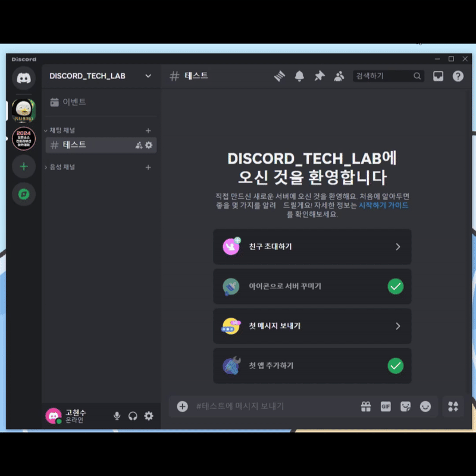

# 👋 Hello World



## Used
- Python 3.10

## References
- [Discord App Overview](https://discord.com/developers/docs/quick-start/overview-of-apps)
- [discord.py](https://discordpy.readthedocs.io/en/latest/quickstart.html)

## Process
1. [프로필 편집] > [고급] > [개발자 모드] 활성화 
2. Applications -> [New Application](https://discord.com/developers/applications)
3. Bot -> Privileged Gateway Intents Presence Intent, Server Members Intent, Message Content Intent Enabled
4. Bot -> Add Bot -> Yes Do It -> Reset Token
5. `pip install requests -t helpers && python helpers/register_commands.py`
6. OAuth2 Url Generator -> applications.commands
7. General Information > APPLICATION ID, PUBLIC KEY

## Deployment
```
cd helloworld

# 1st Deployment
sam build & sam deploy --guided --capabilities CAPABILITY_NAMED_IAM

# Update
sam build & sam deploy --no-confirm-changeset --no-disable-rollback --capabilities CAPABILITY_NAMED_IAM

# Register Command
pip install requests -t helpers && python helpers/register_commands.py
```

## Packages
```
# mkdir -p layer/python
# pip install pynacl requests -t ./layer/python
# Zip layer/ -> layer.zip

pynacl
requests
```